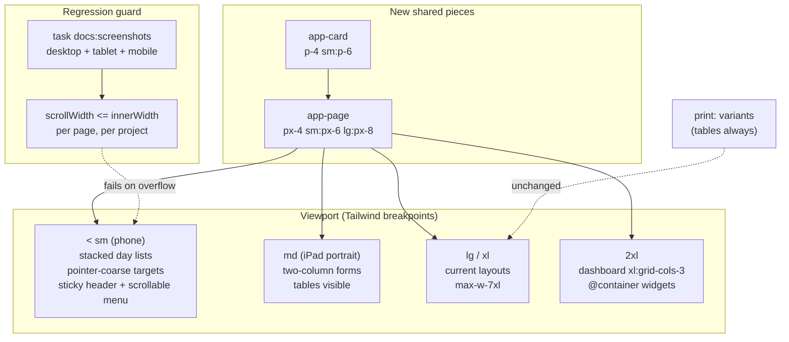

# Responsive layout: phone, tablet and wide desktop

Status: Proposed (not yet implemented)

## Context

Buddy is used on three kinds of screen: a guardian's phone (logging a dose or checking pickup on
the way out), a desktop or laptop (planning the week's meals, the print template editor), and a
child's iPad ([ipad-installation.md](ipad-installation.md)). The frontend was built desktop-first
and only partly adapts to narrow screens:

- **Breakpoints are used sparingly.** Across all non-spec templates there are 90 `sm:`, 20 `lg:`,
  4 `xl:` and zero `md:` or `2xl:` classes. The most common one is `sm:px-8` (page padding, 26
  uses). There is no `@media`, `@container`, `BreakpointObserver` or `matchMedia` for layout
  anywhere in app code. `matchMedia` is only used for dark mode in
  [theme.service.ts](../../../src/frontend/buddy/src/app/core/theme.service.ts).
- **There is no theme layer.** [styles.css](../../../src/frontend/buddy/src/styles.css) is 18
  lines: the Tailwind import, the `dark` custom variant and `color-scheme`. There is no `@theme`
  block, no custom breakpoints and no tokens.
- **There are no shared layout pieces.** The page wrapper `mx-auto max-w-7xl px-6 py-8 sm:px-8` is
  written out 15 times, and the card class string (`rounded-lg border ... bg-white ... p-6`) more
  than 50 times. The 13 controls in `src/app/shared` have no size or density input. The only
  layout input is `segmented-control`'s `wrap`.
- **Navigation is one dropdown.** The guardian shell
  ([guardian-shell.html](../../../src/frontend/buddy/src/app/features/guardian/shell/guardian-shell.html))
  has a logo, a "?" help button and the profile menu. The menu
  ([profile-menu.html:33](../../../src/frontend/buddy/src/app/features/guardian/shell/profile-menu/profile-menu.html))
  is a `w-48` panel holding a theme switcher, 11 links, sign-out and version info. It has no
  `max-h` and no scroll. Child pages have no shell at all; each of the three repeats its own
  header.
- **Testing on a phone means looking at screenshots.**
  [playwright.config.ts](../../../src/frontend/buddy/playwright.config.ts) runs e2e tests on
  Desktop Chrome only. [playwright.screenshots.config.ts](../../../src/frontend/buddy/playwright.screenshots.config.ts)
  also captures an iPhone 15 (393×852) image of every page into
  [docs/screenshots/mobile](../../screenshots/mobile), but nothing checks that image.

### What the phone screenshots show today

The mobile PNGs are taken at `deviceScaleFactor: 2`, so a page that fits is exactly 786 px wide.
**8 of the 26 pages are wider than that**, so the whole page scrolls sideways on a phone:

| Page                             | PNG width | CSS px (393 fits) | Visible cause                                                                                                                                                                                                                                          |
| -------------------------------- | --------- | ----------------- | ------------------------------------------------------------------------------------------------------------------------------------------------------------------------------------------------------------------------------------------------------ |
| `guardian-sleep-diary`           | 1326      | 663               | The 640px history table (in its `overflow-x-auto` wrapper) widens the page grid instead of scrolling inside it                                                                                                                                         |
| `guardian-progress`              | 1070      | 535               | Goal rows: `w-32` number input + icon input + name input + "Remove" in a flex row that doesn't wrap ([manage-progress-goals.html:54](../../../src/frontend/buddy/src/app/features/guardian/progress/manage-progress-goals/manage-progress-goals.html)) |
| `guardian-admin`                 | 1002      | 501               | Calendar and group rows with five or six text actions in a single flex row ([manage-groups.html:24](../../../src/frontend/buddy/src/app/features/guardian/admin/manage-groups/manage-groups.html))                                                     |
| `child-home`                     | 968       | 484               | Medicine rows: name, time, "Taken" and "Skip" don't wrap, so the buttons stick out of the card                                                                                                                                                         |
| `guardian-calendar`              | 874       | 437               | Agenda rows with nowrap time ranges plus Edit/Delete                                                                                                                                                                                                   |
| `guardian-dashboard`             | 850       | 425               | Dose rows: `flex justify-between` with two buttons and no wrap ([doses-today.html:40](../../../src/frontend/buddy/src/app/features/guardian/doses-today/doses-today.html))                                                                             |
| `child-calendar`                 | 834       | 417               | `whitespace-nowrap` times in agenda rows                                                                                                                                                                                                               |
| `guardian-print-template-editor` | 820       | 410               | `w-40` fields in the editor's form rows                                                                                                                                                                                                                |

Content is also hidden on pages that _do_ fit. On `guardian-pickup`, the 520px table scrolls
sideways inside its card, so the whole Pickup column is off-screen. Nothing on the screen hints
that it is there. The meal plan, the work pattern and sleep history work the same way.

There are two root causes, and fixing them is mechanical work:

1. **Flex rows that never wrap.** A `flex items-center justify-between` row, with a label that has
   no `min-w-0` and fixed-size buttons, can only grow sideways.
2. **Grid and flex children that keep their content width.** A grid item's default `min-width:
auto` makes the 640px table inside it set the width of the whole column, so the
   `overflow-x-auto` wrapper never gets to scroll. Only 4 files in `features/` use `min-w-0`.

### Other gaps

- **Touch targets.** The shell's "?" and avatar buttons are 40px. The shared `stepper` buttons are
  32px. About a dozen inline actions are `text-xs py-0.5`/`py-1` text buttons (agenda Edit/Delete,
  admin Reset password/Remove/Delete, share-link Revoke). The child star-rating buttons are 36px
  (`size-9`, [home.html:263](../../../src/frontend/buddy/src/app/features/child/home/home.html)).
  That breaks the [visual specification](visual-specification.md)'s rule that child targets are at
  least 44×44px.
- **Popovers and dialogs have no size limits.** The profile menu, child menu, meal picker, task
  picker and pickup-cell editor are fixed-width panels with no height limit. The meal picker's
  dropdown is `position: fixed` and positioned from `getBoundingClientRect`, so it can open below
  the viewport. [e2e/mealplan-assignment.spec.ts:54](../../../src/frontend/buddy/e2e/mealplan-assignment.spec.ts)
  already works around this. The one modal (`delete-account`) has no `max-h` or scroll.
- **Drag and drop inside a scroll area.** The meal plan uses CDK drag-drop inside the
  `overflow-x-auto` week table. On a touch screen, dragging fights with scrolling, and the drag
  handle is a small glyph explained only by a `title` tooltip, which touch devices never show.
- **Nothing between phone and desktop, and nothing above desktop.** Without `md:`, an iPad in
  portrait (768–834px) gets the phone layout with more padding. Everything is capped at
  `max-w-7xl` (1280px). The dashboard is two columns from `lg` up and stays at two on a 1920px
  screen.

## Consequences of making the design more responsive

This section is the main thing this doc is for: what changes besides the CSS.

### Code

- **No backend changes.** The API contract, `task docs:openapi` and the integration tests are not
  affected.
- **Most of the work is template class changes** in about 45 component templates. The two-thirds
  of templates with no breakpoint classes today (the dashboard widgets, pickup, sleep-diary
  children, work locations, every shared control) are the ones that need them.
- **A small amount of new code**: shared layout components (page, card), a coarse-pointer sizing
  rule, and alternative markup for each of the four week tables (Phase 4). The tables are the only
  part that adds component logic, and only if a stacked phone view needs its own day selection.
- **Print must not regress.** `print:` variants are used 28 times, mostly on the week-plan sheet
  and the shared sleep diary. Phone-only layouts have to be written so they don't apply when
  printing. Phone breakpoints won't match the printed page, but `max-sm:` utilities can, so they
  must be avoided on printable pages. The print sheet route sits outside the shell and scales
  itself from `window.innerWidth` ([week-plan-print-page.ts:136](../../../src/frontend/buddy/src/app/features/guardian/print/sheet/week-plan-print-page.ts)).
  It stays out of scope.

### Tests

- **Unit specs mostly survive.** No Vitest spec asserts a breakpoint class. These specs assert
  styling classes and will need updating if the matching markup is restyled:
  - [segmented-control.spec.ts:39](../../../src/frontend/buddy/src/app/shared/segmented-control/segmented-control.spec.ts)
    (`flex-wrap`, `flex-1`, `rounded-md`)
  - `mealplan.spec.ts` (`bg-slate-950`)
  - `home.spec.ts` and `child-mealplan.spec.ts` (`text-amber-400`, `line-through`)
  - `tasks-today.spec.ts:255`
  - `week-plan-sheet.spec.ts:193`
- **Specs that depend on table structure break if tables turn into card lists.** These query
  `tr`/`td`/`tbody` or `getByRole('row'|'cell')`:
  - unit specs: `manage-pickups`, `pickup-today`, `sleep-diary`, `sleep-history`,
    `shared-sleep-diary`
  - e2e specs: `mealplan-assignment`, `pickup-assignment`, `pickup-babysitter`, `print-week-plan`,
    `sleep-diary-log-and-share`

  This is the strongest argument for Decision 3 below: keep the table in the DOM at `sm` and up,
  and add a phone layout next to it, rather than replace it.

- **Navigation changes ripple into e2e.** `session-expiry`, `help`, `profile-update`,
  `delete-account` and `email-verification` all go through "Open account menu". A new navigation
  bar must keep that menu, or these specs have to change too.
- **New coverage is needed.** Today nothing fails when a page overflows on a phone. Phase 0 adds
  that check, and from then on a layout regression fails `task docs:screenshots` instead of being
  noticed in a PNG weeks later.

### Screenshots and docs

- Every phase changes how pages look, so every phase re-runs `task docs:screenshots` and commits
  new PNGs: 26 desktop and 26 mobile, plus 26 tablet if Decision 5 adds one. Desktop images
  change only where padding or wide-screen layout changes.
- The guardian-shell section of [docs/frontend/README.md](../README.md) gains a "Layout and
  breakpoints" section. The [visual specification](visual-specification.md)'s guardian density row
  needs a phone exception ("dense on `sm` and up, stacked below").

### UX trade-offs

- **Guardian density goes down on phones.** That is intended: a 7-column table on a 393px screen is
  dense only in theory, because most of it is off-screen.
- **Wide desktop gets more columns**, which means more on screen at once on the dashboard. That
  helps in the morning but risks clutter. Phase 6 limits it to the dashboard and keeps reading
  text at about 70ch.
- **Larger touch targets take more space on desktop**, unless they are scoped to coarse pointers.
  Decision 4 does that.

### Effort and risk

| Phase                                              | Size           | Risk                                                   |
| -------------------------------------------------- | -------------- | ------------------------------------------------------ |
| 0 Guardrail + tablet screenshots                   | S (½ day)      | Low: test-only                                         |
| 1 Fix the 8 overflowing pages                      | S–M (1–2 days) | Low: class changes, screenshots show the result        |
| 2 Shared page/card components + responsive padding | M (2–3 days)   | Medium: touches every page, but it's a mechanical swap |
| 3 Touch targets, popover and dialog limits         | S–M (1–2 days) | Low                                                    |
| 4 Phone layout for the four week tables            | M–L (3–5 days) | Medium: table-structure specs, drag-and-drop           |
| 5 Phone navigation                                 | M (2–3 days)   | Medium: e2e navigation paths                           |
| 6 Tablet and wide-desktop layout                   | S–M (1–2 days) | Low                                                    |

Phases 0–3 fix everything that is broken today. Phases 4–6 are improvements and can be stopped at
any point.

## Decision 1: Tailwind breakpoints stay the mechanism, and `md:` becomes the tablet step

**Decision: keep Tailwind's default breakpoints (`sm` 640, `md` 768, `lg` 1024, `xl` 1280, `2xl` 1536) with mobile-first utilities, and start using `md:` for the iPad portrait layout. Add no
custom breakpoints in `styles.css`. Don't introduce `BreakpointObserver`.**

- The house style is already utility-first, with no component stylesheets or `styles:` blocks. A
  CSS-only approach keeps responsiveness out of component logic, so specs don't need to fake a
  viewport.
- **Container queries (`@container`, built into Tailwind 4) only for the dashboard widgets.** They
  sit in a one-column grid on phones and a two- or three-column grid on desktop, so their own width
  matters more than the viewport's. Everywhere else, viewport breakpoints are simpler and match
  what the rest of the code does.
- _Considered and rejected:_ `BreakpointObserver` from `@angular/cdk/layout`, because it moves
  layout into signals and specs for no gain over CSS. The one exception is a component whose DOM
  must differ (Decision 3, if a stacked view needs its own selection state), and even then
  rendering both and hiding one with CSS is preferred.

## Decision 2: shared `app-page` and `app-card` replace the repeated wrapper classes

**Decision: add `shared/page` (container, padding, the optional back link, eyebrow and title) and
`shared/card`, and set responsive spacing once in them: page `px-4 sm:px-6 lg:px-8`, card `p-4
sm:p-6`.**

Today a 393px phone loses 48px to page padding and another 48px to card padding, which leaves about
295px for content. That is the main reason form rows overflow. The new spacing gives back 32px
without changing desktop.

Before
([manage-progress-goals.html:1](../../../src/frontend/buddy/src/app/features/guardian/progress/manage-progress-goals/manage-progress-goals.html)):

```html
<section class="rounded-lg border border-slate-200 dark:border-slate-800 bg-white dark:bg-slate-900 p-6 shadow-sm"></section>
```

After:

```html
<app-card></app-card>
```

Blast radius: 15 page wrappers and roughly 50 cards. It's a find-and-replace with no behaviour
change, but it touches nearly every guardian template, so it should land as its own commit with a
full screenshot run.

_Considered and rejected:_ a Tailwind `@utility card { ... }` in `styles.css`. It's smaller, but it
can't carry the back link or the title markup, and it hides the classes from the template reader.

## Decision 3: on phones, week tables get a stacked day list next to the table

**Decision: below `sm`, the pickup planner, meal-plan assignment, work pattern editor and sleep
history show one card per day (day as heading, then each column as a labelled row). From `sm` up,
and when printing, the existing `<table>` stays as it is. The table is hidden with `max-sm:hidden`
and the list with `sm:hidden`. The month grid and the shared sleep diary keep scrolling sideways.**

- Keeping the table means the table-structure specs and the e2e specs listed above keep passing
  at desktop size, which is the only size e2e runs at.
- The stacked list reuses the existing cell components (`pickup-cell`, `meal-picker`), so phone and
  desktop share the same editing behaviour.
- **On phones, meal-plan drag-and-drop is replaced by the meal picker**, which already exists and
  works by tapping. `cdkDrag` is not added to the stacked list.
- _Considered and rejected:_ converting the tables into CSS grids that reflow. It would break all
  ten table-structure specs and lose table semantics for screen readers.
- _Considered and rejected:_ keeping sideways scrolling and adding a scroll hint. It costs less, but
  on `guardian-pickup` half the job (Pickup) stays hidden by default.
- _Cost:_ both layouts exist in the DOM. Unit specs for the four components need a case for the
  list markup, and the shared `pickup-cell` editor ends up in the DOM twice, so its ids must be
  unique per instance.

## Decision 4: larger touch targets on coarse pointers only

**Decision: use Tailwind 4.1's `pointer-coarse:` variant (the project is on `tailwindcss@^4.1.12`)
to raise interactive controls to at least 44px on touch screens. Keep the current guardian density
with a mouse. The child pages, including the 36px star buttons, go to at least 44px on every
device, as the [visual specification](visual-specification.md) already requires.**

- Shared `stepper` and `segmented-control` get these changes once, and every page that uses them
  benefits.
- Inline text actions (Edit, Delete, Remove, Revoke) get `pointer-coarse:py-2.5 pointer-coarse:px-2`
  rather than a bigger font, so desktop rows don't change.
- _Considered and rejected:_ 44px everywhere. It would lengthen every guardian list on desktop,
  where the visual spec deliberately aims for 32–36px.

## Decision 5: guard against overflow automatically, and add a tablet screenshot

**Decision: in [capture.spec.ts](../../../src/frontend/buddy/screenshots/capture.spec.ts), after
each page has loaded, assert `document.documentElement.scrollWidth <= window.innerWidth`, on every
screenshot project. Add a `tablet` project (`devices['iPad Mini']`, 768×1024) to
`playwright.screenshots.config.ts`, saved to `docs/screenshots/tablet`.**

- This turns a problem found by eye into a failing test, and it reuses the demo family and the
  page list that already exist. It adds no new e2e journeys.
- The 8 pages in the table above fail this check today. Phase 0 can either land with them marked as
  known failures (a `knownOverflow` flag in `pages.ts`, removed in Phase 1) or land together with
  Phase 1.
- A tablet project adds 26 PNGs per run and about a minute to `task docs:screenshots`. The
  generated README (`global-teardown.ts`) needs a third image per page.
- _Considered and rejected:_ a mobile project in the main e2e config. It would run every journey
  twice, while the screenshot run already visits every page.

## Decision 6: phone navigation is a better menu, not a tab bar (for now)

**Decision: keep the profile menu as the only navigation. Make it fit a phone: `max-h-[calc(100dvh-5rem)]
overflow-y-auto`, `max-w-[calc(100vw-2rem)]`, and the missing Pickup link. Make the guardian header
`sticky top-0` so the menu and the "?" button stay within reach on long pages.**

- This keeps "Open account menu", which five e2e specs depend on, and the in-app help design,
  which rejected a drawer because it covers a 393px screen
  ([in-app-help.md](in-app-help.md)).
- _Considered and deferred:_ a bottom tab bar on phones (Dashboard, Calendar, Meals, Medicine,
  More). It's the more native pattern and would make the per-page "Back to dashboard" links
  unnecessary, but it is a navigation redesign rather than a responsive fix. If guardians ask for
  it, it is additive: a new `shell/tab-bar` shown with `sm:hidden`, with the menu kept for the
  rest.

## Plan

Each phase is one worktree branch, landed with `rebase-commit`, ending with `task test` and
`task docs:screenshots`. Each phase also updates the PNGs it changed.

### Phase 0 -- guardrail and tablet screenshots

- `screenshots/capture.spec.ts`: horizontal-overflow assertion (Decision 5).
- `playwright.screenshots.config.ts`: `tablet` project. `global-teardown.ts`: third image per page.
- `docs/screenshots/README.md` intro text (generated).

### Phase 1 -- fix the 8 overflowing pages

- Flex rows: add `flex-wrap` and `min-w-0` on the text side in `doses-today`, the child home's
  medicine rows, `manage-progress-goals`, the `manage-groups`/`manage-calendars` action rows and the
  agenda/child-calendar item rows.
- Progress goals: `w-32` becomes `w-20 sm:w-32`. The row becomes `grid grid-cols-[5rem_3.5rem_1fr]`
  with Remove on its own line below `sm`.
- Sleep diary: give the page grid `grid-cols-[minmax(0,1fr)]` so the history table scrolls inside
  its card.
- Print template editor: `w-40` becomes `w-full sm:w-40`.
- Remove each `knownOverflow` flag as its page is fixed.

### Phase 2 -- `app-page`, `app-card`, responsive spacing

- `shared/page/page.ts` and `shared/card/card.ts`, each with a spec.
- Swap the 15 page wrappers and about 50 cards over. Child pages get a shared `child-page` header
  for the three duplicated ones.
- Add a "Layout and breakpoints" section to `docs/frontend/README.md`.

### Phase 3 -- touch targets, popovers, dialog

- `pointer-coarse:` sizing in `stepper` and `segmented-control`, and on the inline text actions
  listed under [Other gaps](#other-gaps). Child star buttons go to `size-11`.
- Popovers get `max-w-[calc(100vw-2rem)]` and `max-h-[...] overflow-y-auto`. The meal picker
  flips upward when there isn't room below, and the workaround in
  `e2e/mealplan-assignment.spec.ts:54` is removed.
- `delete-account` dialog gets `max-h-[90dvh] overflow-y-auto`.
- Profile menu and sticky header (Decision 6).

### Phase 4 -- stacked phone view for the week tables

- `manage-pickups`, `assign-mealplan` (picker only, no drag), `work-pattern-editor`,
  `sleep-history`: add a `sm:hidden` list next to the `max-sm:hidden` table (Decision 3).
- Unit specs: one case per component for the list markup. The e2e specs stay unchanged.
- `pickup-planning-and-daily-views.md`'s "Responsive behavior" section is updated to match.

### Phase 5 -- (optional) tab bar

- Only if Decision 6 is reopened.

### Phase 6 -- tablet and wide desktop

- Add `md:` steps in long forms (agenda create form, sleep entry form, admin).
- Dashboard: `@container` widgets, and `xl:grid-cols-3` on a wider cap (`max-w-[96rem]`) for
  the dashboard only. Reading text keeps `max-w-prose`.

## Explicitly out of scope

- PWA manifest, `viewport-fit=cover`, safe-area insets and install banners. These belong to
  [ipad-installation.md](ipad-installation.md).
- The print sheet's own scaling and the shared sleep diary's 960px printable table. Both are
  designed for paper.
- Landscape-phone-specific layouts.

## Decisions made

| Question                | Decision                                                                                                                       |
| ----------------------- | ------------------------------------------------------------------------------------------------------------------------------ |
| Mechanism               | Tailwind default breakpoints, mobile-first; `md:` for tablet; `@container` only for dashboard widgets; no `BreakpointObserver` |
| Repeated wrappers       | Shared `app-page` and `app-card` with responsive padding                                                                       |
| Week tables on phones   | Stacked day list beside the existing table (`sm:hidden` / `max-sm:hidden`); tables stay for desktop and print                  |
| Meal-plan drag on touch | Not offered on phones; the meal picker covers it                                                                               |
| Touch targets           | At least 44px on `pointer-coarse:` for guardian pages; at least 44px always on child pages                                     |
| Regression guard        | Overflow assertion in the screenshot run, plus a tablet project                                                                |
| Phone navigation        | Fix the profile menu and make the header sticky; tab bar deferred                                                              |

## Remaining open questions

- **Which devices count as supported?** Lean: iPhone-size phones (≥375px), iPad portrait and
  landscape, and desktop up to 1920px. 320px phones should work without overflow but don't get
  their own layout.
- **Should Phase 0's overflow check block, or warn, until Phase 1 lands?** Lean: land them together
  so the check blocks from the start. That avoids adding a `knownOverflow` flag that exists only
  to be removed.
- **Bottom tab bar now or later?** Lean: later (Decision 6). It's additive, and the menu fix covers
  today's problem.
- **Does the wide-desktop dashboard need three columns at all?** Lean: yes, but only the
  dashboard. Every other page keeps `max-w-7xl`.
- **Does the tablet screenshot replace or add to the mobile one?** Lean: add, so there are three
  images per page in the docs.

## Diagram


